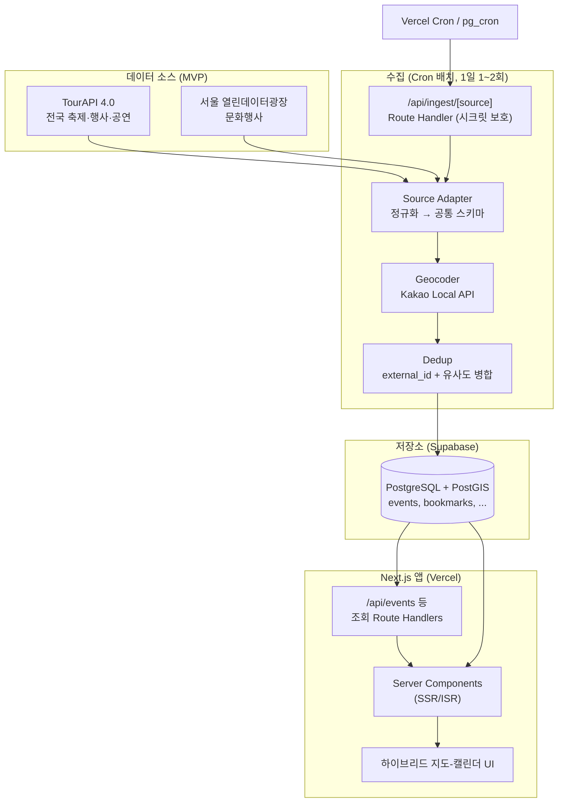
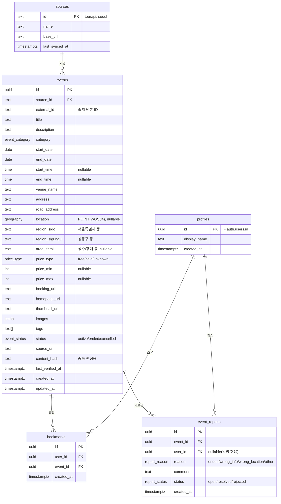

# 로컬 이벤트 캘린더 — 구현 설계서 (MVP)

> 연구 보고서([event_calendar_research.md](event_calendar_research.md))를 실제 구현으로 옮기기 위한 설계 문서입니다.
> 이 문서는 **개인 포트폴리오/학습용** 기준으로 범위를 조정한 청사진이며, 승인 후 코드 착수의 기준선이 됩니다.

---

## 0. 확정된 기술 스택

| 영역 | 선택 | 비고 |
| :--- | :--- | :--- |
| 프레임워크 | **Next.js 15 (App Router)** 풀스택 | 단일 코드베이스. Route Handlers + Server Actions로 API까지 처리 |
| 언어 | TypeScript | |
| 스타일 | Tailwind CSS + Lucide React | 보고서 권장안 유지 |
| 캘린더 | FullCalendar (`@fullcalendar/react`) | |
| 지도 | **Kakao Maps JS SDK** + Kakao Local REST API | 지도 표시 + 지오코딩(주소→좌표) |
| DB | **Supabase** (PostgreSQL + PostGIS) | 무료 티어, 공간쿼리, Auth 내장 |
| 인증 | Supabase Auth (이메일 + Kakao OAuth) | 북마크 기능부터 필요 |
| 배포 | Vercel (앱) + Supabase (DB) | 둘 다 무료 티어로 시작 |
| 배치 스케줄 | Vercel Cron 또는 Supabase `pg_cron` | 데이터 동기화·상태검증 |
| 데이터 패칭 | Server Components + TanStack Query(클라이언트 인터랙션) | |

### 보고서 대비 다운스케일 결정 (중요)

| 보고서 원안 | 본 설계 (MVP) | 이유 |
| :--- | :--- | :--- |
| Kafka/Redis 메시지 큐 | **제거** → Cron 트리거 배치 동기화 | 포트폴리오 규모에선 큐가 불필요한 운영 부담 |
| 별도 LLM 파서 워커 | **2단계로 연기** | MVP는 공공 API의 정형 데이터만 사용 → LLM 없이 동작 |
| Redis 캐시 | **Next.js 캐싱(ISR/`unstable_cache`)** 으로 대체 | 별도 인프라 없이 충분 |
| 별도 Python 백엔드 | **Next.js 단일 코드베이스** | 운영·배포 단순화 |
| 4종 소스 + SNS 크롤링 | **공공 API 2종으로 시작** (TourAPI, 서울열린데이터) | 합법·안정·무료. 크롤링은 별도 단계 |

> 크롤링/LLM 파이프라인은 본 MVP 위에 **얹을 수 있도록** 인터페이스를 열어두되(§4 소스 어댑터 추상화), MVP 범위에는 넣지 않습니다.

---

## 1. 시스템 아키텍처



**핵심 흐름**: Cron이 주기적으로 `/api/ingest/*`를 호출 → 소스 어댑터가 원본을 공통 스키마로 정규화 → (좌표 없으면) 지오코딩 → 중복 제거 후 upsert. 사용자는 Server Component로 렌더된 지도-캘린더 UI에서 조회.

---

## 2. 데이터 모델 (PostgreSQL + PostGIS)

### 2.1 ERD



### 2.2 Enum 타입

```sql
create type event_category as enum
  ('exhibition','festival','concert','performance','popup','academic','etc');
  -- 전시 / 축제 / 콘서트 / 연극·뮤지컬 / 브랜드팝업 / 학술·네트워킹 / 기타
create type price_type    as enum ('free','paid','unknown');
create type event_status  as enum ('active','ended','cancelled');
create type report_reason as enum ('ended','wrong_info','wrong_location','other');
create type report_status as enum ('open','resolved','rejected');
```

### 2.3 핵심 인덱스 & 제약

```sql
-- 출처별 원본 ID 유니크 → 같은 소스 재수집 시 upsert 기준
alter table events add constraint uq_source_external unique (source_id, external_id);

-- 공간쿼리("내 주변 1km") : GIST
create index idx_events_location on events using gist (location);

-- 기간 필터("특정 날짜에 진행 중") : 날짜 범위
create index idx_events_dates on events (start_date, end_date);

-- 다차원 필터
create index idx_events_category on events (category);
create index idx_events_region   on events (region_sido, region_sigungu);
create index idx_events_status    on events (status);

-- 전문 검색(제목/설명) : pg_trgm 또는 tsvector (한국어는 trgm 권장)
create index idx_events_title_trgm on events using gin (title gin_trgm_ops);
```

> **"특정 날짜에 진행 중"** 쿼리는 `start_date <= :d and end_date >= :d`. 기간형 이벤트(팝업·전시)가 많아 단일 날짜 컬럼이 아니라 **시작·종료일 범위**로 모델링하는 것이 핵심.

### 2.4 RLS(Row Level Security) 정책 요약

| 테이블 | 익명(anon) | 로그인 사용자 | 서버(service_role) |
| :--- | :--- | :--- | :--- |
| `events`, `sources` | SELECT only | SELECT only | 전체(수집이 사용) |
| `bookmarks` | ✕ | 본인 행 CRUD | — |
| `event_reports` | INSERT(제보) | 본인 행 CRUD | 전체 |
| `profiles` | ✕ | 본인 행 R/U | — |

> 수집(ingest) 라우트는 `service_role` 키 + 별도 cron 시크릿으로만 호출 가능하게 보호.

---

## 3. 중복 제거 전략

같은 이벤트가 여러 소스/재수집으로 중복될 수 있음. 2단계로 처리:

1. **동일 소스 재수집** — `(source_id, external_id)` 유니크 제약 + `upsert`(ON CONFLICT)로 갱신. 가장 흔하고 확실한 케이스.
2. **소스 간 중복(2단계에서 활성화)** — 보고서의 `유사 제목 + 동일 시작일 + 반경 50m` 규칙:
   - 후보 조회: `start_date` 동일 AND `ST_DWithin(location, cand, 50)`
   - 제목 유사도: `similarity(title, cand_title) > 0.6` (pg_trgm)
   - 매칭 시 `canonical_event_id`로 묶고 대표 레코드만 노출 (MVP에선 컬럼만 준비, 로직은 2단계)

`content_hash` = `md5(정규화된 title + start_date + venue)` — 변경 감지(상태 검증 cron이 활용)용.

---

## 4. 데이터 수집 파이프라인

### 4.1 소스 어댑터 추상화

크롤러/LLM 소스를 나중에 같은 인터페이스로 끼울 수 있도록 어댑터 패턴 사용:

```ts
// lib/sources/types.ts
export interface SourceAdapter {
  id: 'tourapi' | 'seoul';          // 향후 'instagram' | 'newsletter' 추가
  fetchRaw(since?: Date): AsyncIterable<RawRecord>;   // 원본 페이지네이션 수집
  normalize(raw: RawRecord): NormalizedEvent;          // → 공통 스키마
}
// 공통 파이프라인: fetchRaw → normalize → geocodeIfNeeded → dedupUpsert
```

### 4.2 MVP 소스별 매핑

| 소스 | 좌표 | 카테고리 매핑 | 비고 |
| :--- | :--- | :--- | :--- |
| **TourAPI 4.0** | 제공(mapx/mapy) | 축제→festival, 공연/행사→performance 등 contentTypeId 기반 | KTO 인증키 필요. 좌표 있으니 지오코딩 생략 |
| **서울 열린데이터광장** (문화행사) | 일부만 제공 | CODENAME 필드 매핑 | 좌표 없으면 주소→Kakao 지오코딩 |

> 각 소스 응답 필드의 **정확한 매핑표는 구현 착수 시 실제 응답 1건을 받아 확정**합니다(스펙이 미묘하게 다를 수 있음). 설계 단계에선 위 정규화 인터페이스로 충분.

### 4.3 지오코딩

- 주소 → 좌표: **Kakao Local `/v2/local/search/address`** (REST, 서버 전용 키).
- 실패 시 키워드 검색(`/keyword`)으로 폴백, 그래도 실패면 `location=null`로 저장(지도엔 안 뜨고 리스트엔 표시).
- 호출량 절약: 이미 좌표가 있으면 생략, 같은 주소는 메모리/DB 캐시.

### 4.4 스케줄 & 트리거

```
Vercel Cron (vercel.json)
  ├─ 06:00 KST  POST /api/ingest/tourapi   (header: x-cron-secret)
  ├─ 06:10 KST  POST /api/ingest/seoul
  └─ 03:00 KST  POST /api/verify-status    (종료/취소 검증 → status 갱신)
```

- `/api/ingest/[source]`는 `x-cron-secret` 헤더 검증 후 실행(외부 호출 차단).
- 상태 검증: `end_date < today` 인 active 이벤트는 `ended`로 일괄 전환. (상세페이지 재확인은 크롤러 단계에서 고도화)

---

## 5. API 설계 (Route Handlers)

| 메서드 | 경로 | 설명 | 인증 |
| :--- | :--- | :--- | :--- |
| GET | `/api/events` | 필터·검색·페이지네이션 | 공개 |
| GET | `/api/events/[id]` | 단건 상세 | 공개 |
| GET | `/api/events/[id]/ics` | 단건 `.ics` 다운로드 | 공개 |
| GET | `/api/bookmarks` | 내 찜 목록 | 필요 |
| POST | `/api/bookmarks` | 찜 추가 `{eventId}` | 필요 |
| DELETE | `/api/bookmarks/[eventId]` | 찜 해제 | 필요 |
| GET | `/api/bookmarks/ics` | 내 찜 전체 `.ics` | 필요 |
| POST | `/api/reports` | 이벤트 제보 | 공개(익명 허용) |
| POST | `/api/ingest/[source]` | 수집 트리거 | cron 시크릿 |
| POST | `/api/verify-status` | 상태 검증 | cron 시크릿 |

### `GET /api/events` 쿼리 파라미터

```
from, to        # 기간(YYYY-MM-DD). "이 기간에 진행 중"인 이벤트
category         # exhibition|festival|... (복수 가능: category=festival,popup)
sido, sigungu    # 지역 필터
area             # 성수|홍대|강남 ... (area_detail)
price            # free (무료만 보기)
companion        # kid|date|pet (tags 기반)
q                # 제목/설명 검색
lat, lng, radius # 위치 기반(미터). PostGIS ST_DWithin
sort             # date(default) | distance(좌표 있을 때)
page, pageSize   # 기본 1, 50
```

응답(요약):
```json
{
  "items": [{
    "id": "uuid", "title": "...", "category": "popup",
    "startDate": "2026-06-05", "endDate": "2026-06-12",
    "venueName": "...", "lat": 37.54, "lng": 127.05,
    "priceType": "free", "thumbnailUrl": "...", "bookingUrl": "..."
  }],
  "page": 1, "pageSize": 50, "total": 233
}
```

> 캘린더-지도 연동의 핵심: 같은 `/api/events` 응답을 캘린더(날짜별 그룹)와 지도(핀)가 **공유**. 날짜 클릭 시 `from=to=클릭한날`로 재조회 → 지도 핀 필터링.

---

## 6. 프론트엔드 화면 / 컴포넌트 구조

### 6.1 화면(라우트)

| 경로 | 화면 | 렌더링 |
| :--- | :--- | :--- |
| `/` | 하이브리드 지도-캘린더 (메인) | RSC + 클라이언트 인터랙션 |
| `/events/[id]` | 이벤트 상세 | RSC (SEO·OG 태그) |
| `/bookmarks` | 내 찜 목록 | RSC + 인증 |
| `/login` | 로그인 | 클라이언트 |

### 6.2 메인 화면 레이아웃

```
┌─────────────────────────────────────────────┐
│  Header (로고 · 검색 · 로그인)                  │
├───────────────┬─────────────────────────────┤
│  FilterBar    │                             │
│  (카테고리/    │      Kakao Map              │
│   지역/무료/   │   (필터된 이벤트 핀)          │
│   동반자)      │                             │
├───────────────┤                             │
│  FullCalendar │   ← 날짜 클릭 → 핀 필터링      │
│  (월/주 뷰)    │                             │
└───────────────┴─────────────────────────────┘
       모바일: 캘린더 ↔ 지도 탭 전환
```

### 6.3 컴포넌트 트리

```
app/(main)/page.tsx
└─ <EventExplorer>                 # URL searchParams ↔ 필터 상태 동기화
   ├─ <FilterBar>                  # 카테고리/지역/무료/동반자 칩
   ├─ <CalendarView>               # FullCalendar 래퍼, 날짜 클릭 이벤트
   ├─ <MapView>                    # Kakao Map, 핀/클러스터
   │  └─ <EventPin> / <PinPopup>
   └─ <EventList>                  # 선택 날짜의 리스트(모바일 주력)
      └─ <EventCard>
         └─ <BookmarkButton>

app/events/[id]/page.tsx
└─ <EventDetail>
   ├─ <EventHeader> (제목/기간/장소/가격)
   ├─ <EventMap> (단일 핀)
   ├─ <BookmarkButton>
   ├─ <ExportIcsButton>            # /api/events/[id]/ics
   ├─ <ReportButton>              # 제보 모달
   └─ <BookingCta>                # 예매/예약 링크
```

### 6.4 상태/데이터 흐름

- **필터 상태는 URL `searchParams`가 단일 진실 소스(SSOT)** — 공유·뒤로가기·SEO 유리.
- 초기 데이터는 Server Component에서 패칭, 필터 변경 등 클라이언트 인터랙션은 TanStack Query로 `/api/events` 재호출.
- 캘린더↔지도는 같은 데이터셋·같은 `selectedDate`를 공유(상위 `<EventExplorer>`가 보유).

### 6.5 다차원 필터 → 데이터 매핑

| 필터(보고서) | 구현 |
| :--- | :--- |
| 카테고리별 | `events.category` enum |
| 지역별(시·구 + 성수/홍대 세분화) | `region_sido`/`region_sigungu` + `area_detail` |
| 비용별(무료만) | `price_type='free'` |
| 동반자별(아이/연인/반려동물) | `tags` 배열 매칭(수집 시 키워드 → 태그 부여) |

---

## 7. `.ics` 내보내기 & 알림 (보고서 §3-C)

- **MVP 포함**: `.ics` 생성(`ics` npm 패키지). 단건/내 북마크 전체 다운로드 → Google·Apple·Outlook 캘린더 가져오기 호환.
- **2~3단계로 연기**: 카카오 알림톡(비즈니스 채널·승인 필요 → 비용/심사 부담). 대신 MVP에선 브라우저 푸시 또는 이메일(Supabase) 정도까지만 선택적으로.

---

## 8. 디렉토리 구조 (제안)

```
my-local-event-calendar/
├─ src/
│  ├─ app/
│  │  ├─ (main)/page.tsx
│  │  ├─ events/[id]/page.tsx
│  │  ├─ bookmarks/page.tsx
│  │  ├─ login/page.tsx
│  │  ├─ api/
│  │  │  ├─ events/route.ts
│  │  │  ├─ events/[id]/route.ts
│  │  │  ├─ events/[id]/ics/route.ts
│  │  │  ├─ bookmarks/route.ts
│  │  │  ├─ bookmarks/[eventId]/route.ts
│  │  │  ├─ bookmarks/ics/route.ts
│  │  │  ├─ reports/route.ts
│  │  │  ├─ ingest/[source]/route.ts
│  │  │  └─ verify-status/route.ts
│  │  ├─ layout.tsx
│  │  └─ globals.css
│  ├─ components/  (calendar/ map/ filters/ events/ ui/)
│  ├─ lib/
│  │  ├─ supabase/   (client.ts, server.ts, types.ts)
│  │  ├─ sources/    (types.ts, tourapi.ts, seoul.ts, pipeline.ts)
│  │  ├─ geocode/    (kakao.ts)
│  │  ├─ ics/        (build.ts)
│  │  └─ dedup/      (hash.ts)
│  ├─ hooks/
│  └─ types/
├─ supabase/
│  └─ migrations/    (0001_init.sql, ...)
├─ vercel.json       (cron 정의)
├─ .env.local        (키, git 제외)
└─ DESIGN.md
```

### 환경 변수

```
NEXT_PUBLIC_SUPABASE_URL=
NEXT_PUBLIC_SUPABASE_ANON_KEY=
SUPABASE_SERVICE_ROLE_KEY=        # 서버 전용(수집)
NEXT_PUBLIC_KAKAO_MAP_JS_KEY=     # 지도 표시(도메인 제한 설정)
KAKAO_REST_API_KEY=               # 지오코딩, 서버 전용
TOURAPI_SERVICE_KEY=              # 서버 전용
SEOUL_OPENAPI_KEY=                # 서버 전용
CRON_SECRET=                      # ingest/verify 보호
```

---

## 9. 단계별 구현 계획 (마일스톤)

| # | 마일스톤 | 내용 | 검증 기준 |
| :--- | :--- | :--- | :--- |
| **M0** | 셋업 | Next.js+TS+Tailwind, Supabase 연결, env 구성 | 빈 앱 배포·DB 연결 OK |
| **M1** | 스키마 | `0001_init.sql`(enum/테이블/인덱스/RLS), PostGIS 활성화 | 마이그레이션 적용, 더미 1건 insert |
| **M2** | 수집 | TourAPI·서울 어댑터 + 정규화 + 지오코딩 + upsert + cron | 실데이터 수백 건 적재 |
| **M3** | 조회 API | `/api/events` 필터·검색·공간쿼리, `/events/[id]` | 필터별 응답 정확성 확인 |
| **M4** | 메인 UI | 캘린더+지도 하이브리드, 필터바, 날짜↔핀 연동 | 날짜 클릭 시 핀 필터링 동작 |
| **M5** | 상세+ICS | 상세 페이지, `.ics` 단건/전체 내보내기 | 구글 캘린더 가져오기 성공 |
| **M6** | 인증+북마크 | Supabase Auth(이메일/카카오), 찜 CRUD | 로그인 후 찜·해제 |
| **M7** | 제보+검증 | 제보 폼, 상태검증 cron(종료 처리) | 만료 이벤트 자동 ended |
| **2단계** | 데이터 고도화 | 크롤러 + LLM 파서(어댑터로 추가), 소스간 dedup 활성화 | — |
| **3단계** | 소셜·알림 | 공유, 알림(이메일/푸시 → 알림톡) | — |

> 권장 진행: **M0~M5까지가 "보여줄 수 있는 포트폴리오"의 최소선**. M6~M7은 완성도, 2~3단계는 확장.

---

## 10. 기술적 고려사항 / 리스크

| 항목 | 대응 |
| :--- | :--- |
| **API 키 보안** | REST/Service 키는 서버 라우트에서만 사용. Kakao **JS 키는 도메인 화이트리스트** 설정. 모든 시크릿 `.env`(git 제외) |
| **공공 API 호출 제한** | 일 1~2회 배치로 제한. 페이지네이션 백오프. 응답 캐시 |
| **좌표/주소 결측** | 지오코딩 폴백(주소→키워드), 그래도 없으면 `location=null`(리스트만 노출) |
| **시간대** | 전부 KST 기준. 날짜는 `date`(시간 무관), 시각은 `time`로 분리 저장 |
| **크롤링 합법성** | MVP는 **공식 공공 API만** → 합법·안정. SNS/예매처 크롤링은 robots.txt·약관 검토 후 별도 단계. 포트폴리오 목적이므로 무리한 스크래핑 지양 |
| **데이터 신선도** | 상태검증 cron + 사용자 제보(`event_reports`)로 종료/오류 보정 |
| **비용** | Vercel·Supabase·Kakao 모두 무료 티어 내 설계. 초과 시 캐시·배치 주기로 조절 |

---

## 11. 다음 단계 (이 문서 승인 후)

1. **M0~M1 착수** — 프로젝트 스캐폴딩 + DB 마이그레이션 생성.
2. 그 전에 준비가 필요한 외부 키:
   - 공공데이터포털 **TourAPI 서비스키**, 서울 열린데이터광장 **인증키**
   - Kakao Developers 앱 등록 → **JS 키 / REST 키**
   - Supabase 프로젝트 생성 → URL/anon/service 키
3. 키 발급 동안 코드 골격(목업 데이터)으로 UI부터 진행하는 병행 옵션도 가능.

---

### 검토 요청 포인트

- 카테고리 7종(전시·축제·콘서트·연극뮤지컬·팝업·학술·기타) 분류가 적절한지
- M0~M5를 포트폴리오 1차 목표로 잡는 범위가 맞는지
- `.ics`까지는 MVP, 알림톡은 후순위 — 동의하는지
- 인증을 M6(후반)에 두는 순서가 괜찮은지 (북마크 전까진 비로그인으로 충분)
