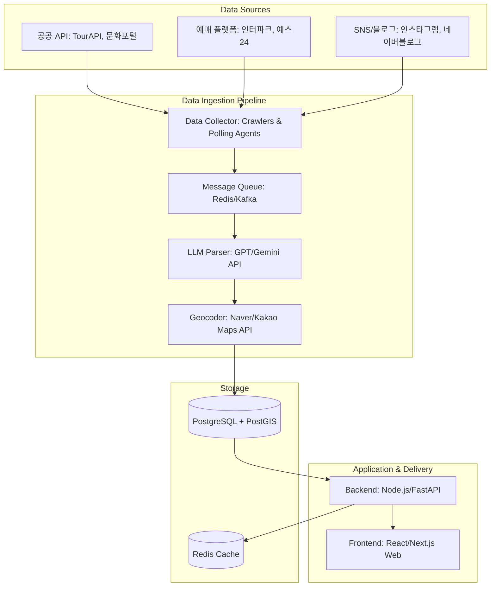

# 대한민국 문화·예술·축제·팝업 이벤트 캘린더 서비스 구축 방안 연구 보고서

대한민국 전역에서 개최되는 전시, 축제, 공연, 팝업스토어 등의 이벤트 일정을 단일 플랫폼에서 수집·가공하고, 이를 사용자 친화적인 캘린더 및 지도 형태로 제공하기 위한 기술 연구 보고서입니다.

---

## 1. 데이터 소스 조사 및 분석 (Data Sources)

국내 이벤트 데이터를 수집하기 위해 활용할 수 있는 채널은 크게 **공공 API**, **공연/예매 플랫폼**, **행사 중개 플랫폼**, **소셜 미디어(SNS) 및 지역 전문 블로그**의 4가지 영역으로 나뉩니다.

### A. 공공 오픈 API (Public Open APIs)
국가 및 지자체 주도로 관리되는 정형 데이터로, 신뢰성이 높고 합법적인 이용이 가능합니다.

| API 제공처 | 주요 제공 데이터 | 특징 및 장점 | 단점/한계 |
| :--- | :--- | :--- | :--- |
| **한국관광공사 TourAPI 4.0** | 전국 축제, 행사, 공연, 관광 정보 | 위경도 좌표, 상세 설명, 이미지 URL 제공. 데이터가 풍부함. | 실시간 업데이트 속도가 다소 느릴 수 있음. |
| **문화포털 API (한국문화정보원)** | 전국 미술관/박물관 전시, 연극, 콘서트 등 | 문화예술 분야에 특화. 전시회 기간, 장소, 가격, 홈페이지 제공. | 마이너한 로컬 이벤트나 트렌디한 팝업스토어 누락. |
| **서울 열린데이터광장** | 서울시 내 문화행사, 공연, 전시 정보 | 서울 지역에 특화되어 매우 상세하고 빠른 정보 갱신. | 서울 이외 지역 데이터 수집 불가. |
| **KOPIS (공연예술 통합전산망)** | 뮤지컬, 연극, 무용, 클래식 공연 등 | 공연 관련 최고 수준의 메타데이터와 예매 순위 정보 제공. | 축제나 브랜드 팝업스토어 데이터는 제외됨. |

### B. 전문 공연/예매 사이트 (Ticketing Platforms)
대형 전시, 콘서트, 대형 축제 등의 티켓팅이 이루어지는 플랫폼입니다.

*   **주요 대상**: 인터파크 티켓, 예스24 티켓, 멜론티켓 등
*   **수집 방법**: 공식 제휴 API가 없는 경우, 웹 크롤링(Web Scraping) 또는 RSS 피드 활용.
*   **특징**: 상업적인 대형 전시와 공연의 메타데이터(일정, 가격, 티켓 예매 링크) 확보에 필수적입니다.

### C. 행사/모임 중개 플랫폼 (Event Aggregators)
IT 컨퍼런스, 네트워킹 파티, 소규모 세미나 등의 일정이 활발히 등록되는 플랫폼입니다.

*   **주요 대상**: 이벤터스(Event-us), Festa.io 등
*   **수집 방법**: 
    *   **이벤터스**: 'Pro 플랜' 이상의 기업 파트너십을 통한 비즈니스 API 연동 지원.
    *   **Festa.io**: 공식 Open API가 존재하지 않으므로 제휴 요청 혹은 주기적 크롤링이 필요.
*   **특징**: 젊은 층 타깃의 테크, 스타트업, 비즈니스 네트워킹 이벤트 데이터를 확보하기 좋습니다.

### D. 트렌디 팝업스토어 및 마이크로 이벤트 (SNS & Blogs)
최근 국내(특히 성수, 홍다, 한남 등)에서 가장 인기가 높은 팝업스토어와 인플루언서 마켓 등의 정보입니다.

*   **주요 대상**: 인스타그램(Instagram) 특정 해시태그/브랜드 계정, 네이버 블로그(예: '성수동고릴라' 등 팝업 정리 전문 블로거), 위픽레터 등 뉴스레터.
*   **수집 방법**: Playwright/Puppeteer 기반 크롤러 구축, 인스타그램 Graph API 모니터링, 혹은 LLM 기반으로 비정형 텍스트(뉴스레터, 블로그 글)를 정형화된 JSON 데이터로 추출.
*   **특징**: 유동성이 매우 크고(1~2주일 운영 후 종료), 사전 예약 링크(캐치테이블, 네이버 예약 등) 파악이 핵심입니다.

---

## 2. 서비스 시스템 아키텍처 제안 (Architecture)

다양한 비정형/정형 데이터 소스로부터 일정을 효율적으로 수집하고 가공하여 사용자에게 실시간으로 서빙하기 위한 아키텍처입니다.



### 단계별 상세 기능 정의

### 1단계: 데이터 수집기 (Ingestion)
*   **API Poller**: 공공 API 및 제휴사 API를 1일 1~2회 동기화합니다.
*   **Scraper Engine**: Playwright 또는 Puppeteer를 사용하여 주요 예매 사이트와 트렌드 블로그의 새 포스트를 실시간/주기적으로 모니터링합니다.

### 2단계: 데이터 정제 및 LLM 활용 파싱 (Processing & Extraction)
비정형 데이터(예: "성수동 OO빌딩에서 6월 5일부터 12일까지 브랜드 팝업을 엽니다. 예약은 인스타 프로필 링크 확인!")를 캘린더에 표시할 수 있는 구조로 변경해야 합니다.
*   **LLM 파서 (Gemini / GPT-4o-mini 활용)**:
    *   크롤링된 본문 텍스트를 LLM에 전달하여 아래와 같은 JSON 구조로 변환합니다.
    ```json
    {
      "title": "XX 브랜드 성수 팝업스토어",
      "startDate": "2026-06-05",
      "endDate": "2026-06-12",
      "location": "서울특별시 성동구 성수이로 XX",
      "bookingLink": "https://...",
      "tags": ["팝업스토어", "성수", "패션"],
      "description": "XX 브랜드의 신제품 런칭 기념 팝업"
    }
    ```
*   **지오코딩 (Geocoding)**: 수집된 주소 정보를 **네이버 지도 API** 또는 **카카오 로컬 API**를 통해 위도/경도 좌표로 변환하여 저장합니다.

### 3단계: 데이터 적재 및 중복 제거 (Storage & Deduplication)
*   **중복 제거 알고리즘**: 여러 채널에서 동일한 이벤트가 수집될 수 있으므로, `(유사한 제목 + 동일한 시작일 + 반경 50m 이내의 동일 장소)` 조건을 기반으로 중복 데이터를 병합(Merge)합니다.
*   **PostgreSQL + PostGIS**: 위치 기반 쿼리(예: "내 주변 1km 이내에서 오늘 열리는 행사")를 빠르게 수행하기 위해 공간 데이터베이스를 활용합니다.

---

## 3. 핵심 UI/UX 및 기능 제안 (UI/UX Design)

캘린더 서비스는 시각적 매력도와 직관성이 최우선입니다. 사용자를 사로잡기 위한 핵심 기능을 제안합니다.

### A. 하이브리드 지도-캘린더 뷰 (Map-Calendar View)
*   좌측/상단에는 **FullCalendar** 기반의 직관적인 캘린더 인터페이스를 배치하고, 우측/하단에는 **네이버 지도**를 결합합니다.
*   캘린더에서 특정 날짜를 클릭하면 해당 날짜에 진행 중인 전국의 이벤트 핀(Pin)들이 지도 위에 실시간으로 필터링되어 노출됩니다.

### B. 다차원 필터링 시스템 (Smart Filtering)
*   **카테고리별**: 전시, 축제, 콘서트, 연극/뮤지컬, 브랜드 팝업, 학술/네트워킹
*   **지역별**: 서울(성수, 홍대, 강남 등 상세 세분화), 경기, 부산, 제주 등 지자체 기준 필터
*   **비용별**: 무료 이벤트만 보기 필터
*   **동반자별**: 아이와 함께 가기 좋은, 연인과 데이트 코스, 반려동물 동반 가능

### C. 퍼스널 알림 및 캘린더 연동 (Export & Notifications)
*   가고 싶은 이벤트를 찜(북마크)하면, **Google Calendar, Apple Calendar, Outlook Calendar**로 바로 내보내기할 수 있는 `.ics` 파일 또는 단축 링크 제공.
*   카카오톡 알림톡 연동을 통해 "관심 등록한 팝업스토어가 내일 시작됩니다!" 또는 "예약 오픈 10분 전 알림" 발송.

---

## 4. 기술적 고려사항 (Challenges)

1.  **데이터 품질 및 실시간성 관리**:
    *   행사 일정이 갑자기 취소되거나 장소가 변경되는 경우 대처가 어렵습니다.
    *   **대응 방안**: 사용자 제보 기능(리포트)을 활성화하고, 매일 특정 시간대에 크롤러가 기존 등록된 이벤트들의 상세 페이지를 리체크하여 활성화 상태를 검증하는 로직을 포함합니다.

---

## 5. 추천 기술 스택 (Tech Stack Recommendation)

*   **Frontend**: Next.js (SEO 최적화에 유리), Tailwind CSS, Lucide React (아이콘), FullCalendar Component
*   **Backend**: Python FastAPI (크롤러 및 AI/LLM 파이프라인 연동에 유리) 또는 NestJS (대규모 백엔드 구조화에 유리)
*   **Web Scraper**: Playwright (Python/JS 지원)
*   **Database**: Supabase (PostgreSQL 내장, 실시간 기능 및 지도 좌표 쿼리 간편 제공)
*   **Maps API**: Naver Maps Enterprise API 또는 Kakao Maps API

---

## 6. 향후 개발 단계별 Action Plan

1.  **1단계 (MVP 개발)**: 공공데이터포털의 `TourAPI`와 `서울 열린데이터광장 문화행사 API`만 연동하여, **Next.js + Supabase + Naver Map** 구조로 지도 기반 캘린더 MVP를 빠르게 제작합니다.
2.  **2단계 (데이터 고도화)**: 특정 지역(예: 성수동)에 특화된 팝업스토어 정보 블로그/SNS 크롤러를 연동하고, AI(Gemini API)를 도입해 비정형 일정을 파싱하는 파이프라인을 추가합니다.
3.  **3단계 (소셜 서비스)**: 사용자 회원가입, 내 캘린더 저장 기능, 친구 공유 기능 및 카카오톡 알림봇을 결합하여 서비스 유입을 다각화합니다.
